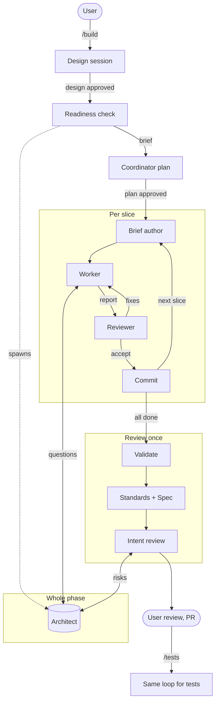

# skills

Agent skills for a design → delegate → review workflow: a human designs with one agent, a thin coordinator cuts the approved work into slices, cheap workers implement them, and a strong reviewer gates each slice.

## Workflow



- **Design session**: the user designs with one agent: requirements, modules, data flow, test scenarios.
- **Readiness check**: the architect reads the approved docs cold; the design session fills every gap in `architecture.md`. The architect stays for the whole phase.
- **Coordinator plan**: slices, file ownership, worker models; nothing runs until the user approves it.
- **Per slice**: a one-shot brief author writes the slice brief; a worker implements and validates it, asking the architect directly; a one-shot reviewer checks the diff against the brief; the coordinator commits.
- **Review once**: full validation, Standards and Spec reviewers, then an intent reviewer that checks the change against the architecture's intent together with the architect.

The coordinator stays thin: code and diffs are read only by one-shot roles, and the architect keeps its context for decisions by sending code research to read-only subagents.

## Skills

| Skill | Invoked by | What it does |
|---|---|---|
| `build` | user | Design a feature together, delegate implementation, reconcile, review once |
| `impl` | user | Implement one ticket for human review, without tests or commits |
| `tests` | user | Choose and write durable tests after human review |
| `delegating-slices` | model | Coordinator workflow: roles, slices, briefs, architect questions, review gate |
| `implement-slice` | model | Worker side of one delegated slice |
| `testing-scenarios` | model | Pick critical, optional and excluded test scenarios |
| `multi-agent-delegate` | model | Run delegates in Herdr tabs (pi or Claude); role map of harness, model and thinking in `models.md`; waiting scripts in `scripts/` |

## Install

```bash
npx skills add St0necrusher/skills
```

The workflow also reaches skills from [mattpocock/skills](https://github.com/mattpocock/skills) (`domain-modeling`, `grilling`, `research`, `code-review`, `writing-for-agents`):

```bash
npx skills add mattpocock/skills
```

`multi-agent-delegate` needs [Herdr](https://github.com/herdrdev/herdr) and its `herdr` skill. Adjust `skills/multi-agent-delegate/models.md` to the models your subscriptions offer.
